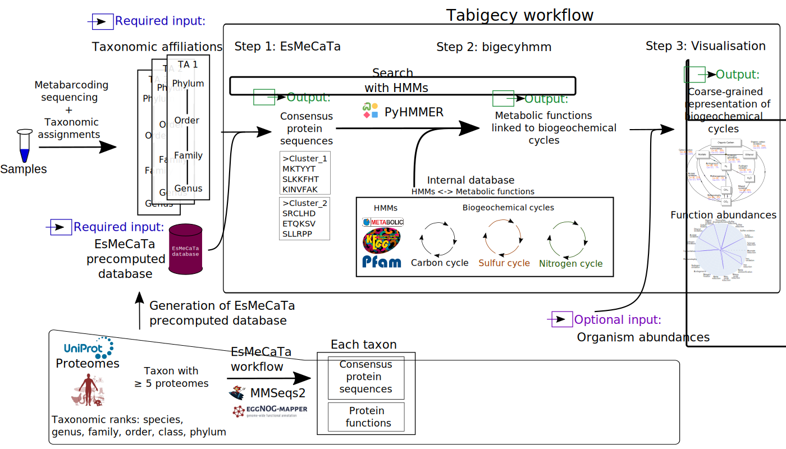

[](https://doi.org/10.1093/bioinformatics/btaf230)

# Tabigecy: linking taxon to biogeochemical cycles

A nextflow workflow to predict functions involving major biogeochemical cycles (carbon, sulfur, nitrogen) for taxonomic affiliations (that can be generated from metabarcoding or metagenomic sequencing). It relies on [EsMeCaTa](https://github.com/AuReMe/esmecata) and [bigecyhmm](https://github.com/ArnaudBelcour/bigecyhmm).



## Requirements

- [Nextflow](https://www.nextflow.io/docs/latest/install.html): to run the workflow.
- [esmecata](https://github.com/AuReMe/esmecata), [bigecyhmm](https://github.com/ArnaudBelcour/bigecyhmm) and several python packages for visualisation: they can be installed with the following pip command: `pip install esmecata bigecyhmm seaborn pandas`.
- esmecata precomputed database: it can be downloaded from this [Zenodo archive](https://doi.org/10.5281/zenodo.13354073). This precomputed database size is 4 Gb.

## Usage

This workflow can be called by nextflow in two ways:

- by downloading this repository and calling the `tabigecy.nf` file with `nextflow run tabigecy.nf ...`.
- by calling the GitHub repository in the nextflow command with `nextflow run ArnaudBelcour/tabigecy ...`. To run the latest version present on GitHub, add the `-latest` argument.

You can print the help with the following command:

`nextflow run ArnaudBelcour/tabigecy --help`

Tabigecy workflow expects three mandatory inputs:
- `--infile` expects a tabulated file containing input taxonomic affiliations for EsMeCaTa, looking like this:

| observation_name | taxonomic_affiliation                                                                                        |
|------------------|--------------------------------------------------------------------------------------------------------------|
| Cluster_1        | Bacteria;Spirochaetes;Spirochaetia;Spirochaetales;Spirochaetaceae;Sphaerochaeta;unknown species              |
| Cluster_2        | Bacteria;Chloroflexi;Anaerolineae;Anaerolineales;Anaerolineaceae;ADurb.Bin120;unknown species                |
| Cluster_3        | Bacteria;Cloacimonetes;Cloacimonadia;Cloacimonadales;Cloacimonadaceae;Candidatus Cloacimonas;unknown species |
| Cluster_4        | Bacteria;Bacteroidetes;Bacteroidia;Bacteroidales;Rikenellaceae;Rikenellaceae RC9 gut group;unknown species   |
| Cluster_5        | Bacteria;Cloacimonetes;Cloacimonadia;Cloacimonadales;Cloacimonadaceae;W5;unknown species                     |
| Cluster_6        | Bacteria;Bacteroidetes;Bacteroidia;Bacteroidales;Dysgonomonadaceae;unknown genus;unknown species             |
| Cluster_7        | Bacteria;Firmicutes;Clostridia;Clostridiales;Clostridiaceae;Clostridium;unknown species                      |

- `--precomputedDB` expects the zip file containing EsMeCaTa precomputed database, [available here](https://doi.org/10.5281/zenodo.13354073). It is possible to give multiple precomputed databases, separated by a space such as `--precomputedDB "esmecata_database1.zip esmecata_database2.zip"`. EsMeCaTa will first use *esmecata_database1.zip* and for taoxnomic affiliations not found in this database, it will search in *esmecata_database2.zip*.
- `--outputFolder` expects a path where the output will be generated.

There are optional arguments:
- `--inAbundfile`: expects a tabulated file containing the abundances in different samples for the different rows of the EsMeCaTa input file, looking like this:

| observation_name | sample 1 | sample 2 | sample 3 |
|------------------|----------|----------|----------|
| Cluster_1        | 50       |  400     | 2300     |
| Cluster_2        | 1000     |   56     | 488      |
| Cluster_3        | 2000     |  597     |  20      |
| Cluster_4        | 0        |  1200    | 600      |
| Cluster_5        | 400      |  420     | 380      |
| Cluster_6        | 4858     |  2478    | 1878     |
| Cluster_7        | 1        |  24      |  75      |


- `--coreBigecyhmm`: the number of cores given to bigecyhmm for multiprocessing.

At the end, it will create an output folder containing the output folders of EsMeCaTa, the one of bigecyhmm and the visualisation output folder.
To do this on your own file you can specify the input files with the command line:

```bash
nextflow run ArnaudBelcour/tabigecy --infile esmecata_input_file.tsv --inAbundfile abundance.tsv --precomputedDB esmecata_database.zip --outputFolder output_folder --coreBigecyhmm 5
```

You can test it on a little example with the different files present in the `test` folder (which takes few minutes to run):

```bash
nextflow run ArnaudBelcour/tabigecy --infile test_taxonomic_affiliations.tsv --inAbundfile test_abundance_file.tsv --precomputedDB esmecata_test_database.zip --outputFolder output_test
```

Furthermore, you can find two other example (from the article associated with tabigecy) in the [Zenodo archive](https://doi.org/10.5281/zenodo.14762347) (`article_data.zip`), associated with the dataset used in the article of Tabigecy:
- Bordenave et al. dataset: `bordenave_et_al_2013.tsv` (EsMeCaTa input file, for argument `--infile`) and `bordenave_et_al_2013_abundance.csv` (abundance file for argument `--inAbundfile`).
- Schwab et al. dataset: `schwab_et_al_2022.tsv` (EsMeCaTa input file, for argument `--infile`) and `schwab_et_al_2022_abundance.tsv` (abundance file for argument `--inAbundfile`)

## Output

An output folder (by default called `output_folder`) is created. It contains three subfolders:
- `output_1_esmecata`: the output folder of the `esmecata precomputed` command. For more information, look at [EsMeCaTa readme](https://github.com/AuReMe/esmecata?tab=readme-ov-file#esmecata-outputs).
- `output_2_bigecyhmm`: the output folder of `bigecyhmm` command. For more information, look at [bigecyhmm readme](https://github.com/ArnaudBelcour/bigecyhmm?tab=readme-ov-file#output-of-bigecyhmm).
- `output_3_visualisation`: the output folder for the visualisation of the predictions and (if given) the addition of sample abundances. This folder is also presented [bigecyhmm readme](https://github.com/ArnaudBelcour/bigecyhmm?tab=readme-ov-file#output-of-bigecyhmm_visualisation).

There is a tutorial explaining several of the outputs from Tabigecy: [tabigecy output](https://github.com/ArnaudBelcour/tabigecy/tree/main/tutorials).

## EsMeCaTa output folder

````
output_1_esmecata
├── 0_proteomes
  ├── association_taxon_taxID.json
  ├── proteome_tax_id.tsv
  ├── esmecata_metadata_proteomes.json
  ├── stat_number_proteome.tsv
  ├── taxonomy_diff.tsv
├── 1_clustering
  ├── computed_threshold
  │   └── Taxon_name_1.tsv
  │   └── ...
  ├── reference_proteins_consensus_fasta
  │   └── Taxon_name_1.faa
  │   └── ...
  ├── proteome_tax_id.tsv
  ├── esmecata_metadata_clustering.json
  ├── stat_number_clustering.tsv
├── 2_annotation
  ├── annotation_reference
  │   └── Cluster_1.tsv
  │   └── ...
  ├── pathologic
  │   └── Cluster_1
  │       └── Cluster_1.pf
  │   └── ...
  │   └── taxon_id.tsv
  ├── function_table.tsv
  ├── esmecata_metadata_annotation.json
  ├── stat_number_annotation.tsv
├── esmecata_metadata_precomputed.json
├── esmecata_precomputed.log
├── organism_not_found_in_database.tsv
├── stat_number_precomputed.tsv
````

### EsMeCaTa output proteomes subfolder

`association_taxon_taxID.json` contains for each `observation_name` the name of the taxon and the corresponding taxon_id found with `ete3`.

`proteome_tax_id.tsv` contains the name, the taxon_id and the proteomes associated with each `observation_name`.

`esmecata_metadata_proteomes.json` is a log about the Uniprot release used and how the queries ware made (REST or SPARQL). It also gets the metadata associated with the command used with esmecata and the dependencies.

`stat_number_proteome.tsv` is a tabulated file containing the number of proteomes found for each observation name.

`taxonomy_diff.tsv` is a tabulated file indicating the taxon selected by EsMeCaTa compared to the lowest taxon in the taxonomic affiliations.

### EsMeCaTa output clustering subfolder

The `computed_threshold` folder contains the ratio of proteomes represented in a cluster compared to the total number of proteomes associated with a taxon. If the ratio is equal to 1, it means that all the proteomes are represented by a protein in the cluster, 0.5 means that half of the proteoems are represented in the cluster. This score is used when giving the `-t` argument.

The `reference_proteins_consensus_fasta` contains the consensus proteins associated with a taxon name for the cluster kept after clustering process.

The `proteome_tax_id.tsv` file is the same than the one created in `esmecata proteomes`.

`esmecata_metadata_clustering.json` is a log about the the metadata associated with the command used with esmecata and the dependencies.

`stat_number_clustering.tsv` is a tabulated file containing the number of shared proteins found for each observation name.

### EsMeCaTa output annotation subfolder

The `annotation_reference` contains the prediction of eggnog-mapper for the consensus protein of each `observation_name`. To create this file, EsMeCaTa finds the taxon name associated with the `observation_name` and extracts the annotation (EC numbers, GO termes, KEGG reaction).

The `pathologic` folder contains one sub-folder for each `observation_name` in which there is one PathoLogic file. There is also a `taxon_id.tsv` file which corresponds to a modified version of `proteome_tax_id.tsv` with only the `observation_name` and the `taxon_id`. This folder can be used as input to [mpwt](https://github.com/AuReMe/mpwt) to reconstruct draft metabolic networks using Pathway Tools PathoLogic.

The file `function_table.tsv` contains the EC numbers and GO Terms present in each observation name.

The `esmecata_metadata_annotation.json` serves the same purpose as the one used in `esmecata proteomes` to retrieve metadata about Uniprot release at the time of the query. It also gets the metadata associated with the command used with esmecata and the dependencies.

`stat_number_annotation.tsv` is a tabulated file containing the number of GO Terms and EC numbers found for each observation name.

## bigecyhmm output folder

```
output_2_bigecyhmm
├── diagram_figures
  ├── carbon_cycle.png
  ├── nitrogen_cycle.png
  ├── other_cycle.png
  ├── phosphorus_cycle.png
  ├── sulfur_cycle.png
├── diagram_input
  └── Taxon_name_1.txt
  └── ...
├── hmm_results
  └── Taxon_name_1.tsv
  └── ...
├── bigecyhmm.log
├── bigecyhmm_metadata.json
├── function_presence.tsv
├── pathway_presence.tsv
├── pathway_presence_hmms.tsv
├── Total.R_input.txt
```

bigecyhmm output `diagram_figures` subfolder: Four png files each showing the percentage of taxon having each functions for carbon, sulfur, nitrogen and other cycles.

bigecyhmm output `diagram_input` subfolder: One txt file for each taxon analysed. It shows the presence/absence of the major functions of the biogeochemical cycles.

bigecyhmm output `hmm_results` subfolder: One tsv file for each taxon considered. It indicates matches between input protein sequences and HMMs.

`bigecyhmm.log`: log file.

`bigecyhmm_metadata.json`: bigecyhmm metadata (Python version used, package version used).

`function_presence.tsv`: occurrence of the functions in the different input protein files.

`pathway_presence.tsv`: occurrence of the major metabolic pathways in the different inputs files.

`pathway_presence_hmms.tsv`: HMMs with matches for the major metabolic pathways in the different inputs files.

`Total.R_input.txt`: ratio of the occurrence of major metabolic pathways in the all communities.


## Visualisaiton output folder

It contains several figures and their associated input files.

````
output_3_visualisation
├── function_abundance
│   ├── cycle_diagrams_abundance
│   |   └── sample_1_carbon_cycle.png
│   |   └── sample_1_nitrogen_cycle.png
│   |   └── ...
│   ├── cycle_participation
│   |   └── sample_1.tsv
│   |   └── ...
│   ├── function_participation
│   |   └── sample_1.tsv
│   |   └── ...
│   └── barplot_esmecata_found_organism_sample.tsv
│   └── barplot_esmecata_found_taxon_sample.png
│   └── barplot_esmecata_missing_organism_sample.tsv
│   └── cycle_abundance_sample_melted.tsv
│   └── cycle_abundance_sample.tsv
│   └── cycle_abundance_sample_raw.tsv
│   └── function_abundance_sample.tsv
│   └── heatmap_abundance_samples.png
│   └── polar_plot_abundance_sample_1.png
│   └── polar_plot_abundance_sample_XXX.png
├── function_occurrence
│   └── cycle_occurence.tsv
│   └── diagram_carbon_cycle.png
│   └── diagram_nitrogen_cycle.png
│   └── diagram_sulfur_cycle.png
│   └── diagram_other_cycle.png
│   └── function_occurrence.tsv
│   └── function_occurrence_in_organism.tsv
│   └── heatmap_occurrence.png
│   └── pathway_presence_in_organism.tsv
├── bigecyhmm_visualisation.log
├── bigecyhmm_visualisation_metadata.json
````

`function_abundance` is a folder containing all visualisation associated with abundance values. It contains:

- `barplot_esmecata_found_taxon_sample.png`: a barplot displaying the coverage of EsMeCaTa according to the abundances from samples. Each bar corresponds to a sample, the y-axis shows the relative abundances of the organisms in the sample. The color indicates which taxonomic rank has been used by EsMeCaTa to predict the consensus proteomes. If EsMeCaTa was not able to predict a consensus proteomes, it is displayed in category `Not found`. With this figure, you can have an idea if there is enough predictions for the different samples in the dataset and at which taxonomic ranks these predictiosn have been made. Thus allowing the estimation of the quality of the predictions: predictions are better if they are closer to lower taxonomic ranks (genus family). `barplot_esmecata_found_organism_sample.tsv` is the input file used to create the figure.
- `cycle_diagrams_abundance`: a folder containing 4 cycle diagrams (carbon, sulfur, nitrogen and other) from METABOLIC per sample from the abundance file. For each sample, it gives the abundance and the relative abundance (in percentage) of the major function.
- `function_participation`: a folder containing one tabulated file per sample from the abundance file. For each sample, it gives the function abundance associated with each organism in the community.
- `cycle_participation`: a folder containing one tabulated file per sample from the abundance file. For each sample, it gives the cycle abundance associated with each organism in the community.
- `function_abundance_sample.tsv`: a tabulated file containing the ratio of abundance of each function in the different sample. Rows correspond to the functions and columns correspond to the samples. It is used to create the `heatmap_abundance_samples.png` file.
- `heatmap_abundance_samples.png`: a heatmap showing the abundance for all the HMMs searched by bigecyhmm in the different samples.
- `cycle_abundance_sample_raw.tsv`: a tabulated file showing the abundance of major functions in biogeochemical cycles (it consists of the sum of abundance of organisms predicted to have the functions). Rows correspond to the major functions and columns correspond to the samples. Compared to `cycle_abundance_sample.tsv`, it shows the absolute abundance (without weightening by total abundance in the sample).
- `cycle_abundance_sample.tsv`: a tabulated file showing the relative abundance of major functions in biogeochemical cycles (sum of organism abundance divided by total abudance in sample). Rows correspond to the major functions and columns correspond to the samples.
- `polar_plot_abundance_samples_XXXX.png`: a polar plot showing the abundance of major functions in the sample `XXXX`.

`function_occurrence` is a folder containing all visualisation associated with occurrence values. It contains:

- `cycle_occurence.tsv`: a tabulated file showing the occurrence of major functions in biogeochemical cycles. Rows correspond to the major function and the column corresponds to the community.
- `diagram_*.png`: diagram representing a biogeochemical cycles (carbon, nitrogen, sulfur, other) from METABOLIC. It shows the number of organisms with predicted major functions (*Occurrence*) and the relative occurrence (*Percentage*) of these functions.
- `function_occurrence.tsv`: a tabulated file containing the ratio for each function. Rows correspond to the function and the column corresponds to the community. It is used to create the `heatmap_occurrence.png` file.
- `function_occurrence_in_organism.tsv`: a tabulated file containing the occurrence of function in each organism of the samples.
- `heatmap_occurrence.png`: a heatmap showing the occurrence for all the HMMs searched by bigecyhmm in the community (all the input protein files).
- `pathway_presence_in_organism.tsv`: a tabulated file containing the occurrence of cycle funcitons in each organism of the samples.
- `swarmplot_function_ratio_community.png`: a swarmplot showing the occurrence of major functions in the samples.

`bigecyhmm_visualisation.log` is a log file.

`bigecyhmm_visualisation_metadata.json` is a metadata file giving information on the version of the package used.

## Citation

For Tabigecy and bigecyhmm:

Arnaud Belcour, Loris Megy, Sylvain Stephant, Caroline Michel, Sétareh Rad, Petra Bombach, Nicole Dopffel, Hidde de Jong and Delphine Ropers. Predicting coarse-grained representations of biogeochemical cycles from metabarcoding data *Bioinformatics*, Volume 41, Issue Supplement_1, July 2025, Pages i49–i57, https://doi.org/10.1093/bioinformatics/btaf230

For EsMeCaTa:

Arnaud Belcour, Pauline Hamon-Giraud, Alice Mataigne, Baptiste Ruiz, Yann Le Cunff, Jeanne Got, Lorraine Awhangbo, Mégane Lebreton, Clémence Frioux, Simon Dittami, Patrick Dabert, Anne Siegel, Samuel Blanquart. Estimating consensus proteomes and metabolic functions from taxonomic affiliations. *bioRxiv* 2022.03.16.484574; doi: https://doi.org/10.1101/2022.03.16.484574

## License

This software is licensed under the GNU GPL-3.0-or-later, see the [LICENSE](https://github.com/ArnaudBelcour/tabigecy/blob/main/LICENSE) file for details.
