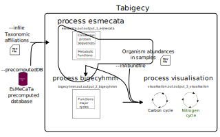

# Taxon to Biogeochemical Cycle

A nextflow workflow created to predict functions involving major biogeochemical cycles (carbon, sulfur, nitrogen) for taxonomic affiliations (that can be created from metabarcoding or metagenomic sequencing). It relies on [EsMeCaTa](https://github.com/AuReMe/esmecata) and [bigecyhmm](https://github.com/ArnaudBelcour/bigecyhmm).



## Requirements

- [Nextflow](https://www.nextflow.io/docs/latest/install.html): to run the workflow.
- esmecata, bigecyhmm and several python packages for visualisation: they can be installed with the following pip command: `pip install esmecata bigecyhmm seaborn pandas plotly kaleido`.
- esmecata precomputed database: it can be downloaded from this [Zenodo archive](https://doi.org/10.5281/zenodo.13354073). This precomputed database size is 4 Gb.

## Usage

This workflow can be called by nextflow in two ways:

- by downloading this repository and calling the `tabigecy.nf` file with `nextflow run tabigecy.nf ...`.
- by calling the GitHub repository in the nextflow command with `nextflow run ArnaudBelcour/tabigecy ...`.

You can print the help with the following command:

`nextflow run ArnaudBelcour/tabigecy --help`

By default, the script will be using files in the directory where the script has been launched. It uses 3 files:
- EsMeCaTa input file.
- EsMeCaTa precomputed database.

Optionally, it can take:
- Abundance file containing the abundance in different samples for the different rows of the EsMeCaTa input file.


At the end, it will create an output folder containing the output folders of EsMeCaTa, the one of bigecyhmm and the visualisation output folder.
To do this on your own file you can specify the input files with the command line:

`nextflow run ArnaudBelcour/tabigecy --infile esmecata_input_file.tsv --inAbundfile abundance.tsv --precomputedDB esmecata_database.zip --visualisationScript create_bigecyhmm_plot.py --outputFolder output_folder --coreBigecyhmm 5`

## Output

An output folder (by default called `output_folder`) is created. It contains three subfolders:
- `output_1_esmecata`: the output folder of the `esmecata precomputed` command. For more information, look at [EsMeCaTa readme](https://github.com/AuReMe/esmecata?tab=readme-ov-file#esmecata-outputs).
- `output_2_bigecyhmm`: the output folder of `bigecyhmm` command. For more information, look at [bigecyhmm readme](https://github.com/ArnaudBelcour/bigecyhmm?tab=readme-ov-file#output).
- `output_3_visualisation`: the output folder for the visualisation of the predictions and (if given) the addition of sample abundances.

## EsMeCaTa output folder

````
output_1_esmecata
├── 0_proteomes
  ├── association_taxon_taxID.json
  ├── proteome_tax_id.tsv
  ├── esmecata_metadata_proteomes.json
  ├── stat_number_proteome.tsv
  ├── taxonomy_diff.tsv
├── 1_clustering
  ├── computed_threshold
  │   └── Taxon_name_1.tsv
  │   └── ...
  ├── reference_proteins_consensus_fasta
  │   └── Taxon_name_1.faa
  │   └── ...
  ├── proteome_tax_id.tsv
  ├── esmecata_metadata_clustering.json
  ├── stat_number_clustering.tsv
├── 2_annotation
  ├── annotation_reference
  │   └── Cluster_1.tsv
  │   └── ...
  ├── pathologic
  │   └── Cluster_1
  │       └── Cluster_1.pf
  │   └── ...
  │   └── taxon_id.tsv
  ├── function_table.tsv
  ├── esmecata_metadata_annotation.json
  ├── stat_number_annotation.tsv
├── esmecata_metadata_precomputed.json
├── esmecata_precomputed.log
├── organism_not_found_in_database.tsv
├── stat_number_precomputed.tsv
````

### EsMeCaTa output proteomes subfolder

`association_taxon_taxID.json` contains for each `observation_name` the name of the taxon and the corresponding taxon_id found with `ete3`.

`proteome_tax_id.tsv` contains the name, the taxon_id and the proteomes associated with each `observation_name`.

`esmecata_metadata_proteomes.json` is a log about the Uniprot release used and how the queries ware made (REST or SPARQL). It also gets the metadata associated with the command used with esmecata and the dependencies.

`stat_number_proteome.tsv` is a tabulated file containing the number of proteomes found for each observation name.

`taxonomy_diff.tsv` is a tabulated file indicating the taxon selected by EsMeCaTa compared to the lowest taxon in the taxonomic affiliations.

### EsMeCaTa output clustering subfolder

The `computed_threshold` folder contains the ratio of proteomes represented in a cluster compared to the total number of proteomes associated with a taxon. If the ratio is equal to 1, it means that all the proteomes are represented by a protein in the cluster, 0.5 means that half of the proteoems are represented in the cluster. This score is used when giving the `-t` argument.

The `reference_proteins_consensus_fasta` contains the consensus proteins associated with a taxon name for the cluster kept after clustering process.

The `proteome_tax_id.tsv` file is the same than the one created in `esmecata proteomes`.

`esmecata_metadata_clustering.json` is a log about the the metadata associated with the command used with esmecata and the dependencies.

`stat_number_clustering.tsv` is a tabulated file containing the number of shared proteins found for each observation name.

### EsMeCaTa output annotation subfolder

The `annotation_reference` contains the prediction of eggnog-mapper for the consensus protein of each `observation_name`. To create this file, EsMeCaTa finds the taxon name associated with the `observation_name` and extracts the annotation (EC numbers, GO termes, KEGG reaction).

The `pathologic` folder contains one sub-folder for each `observation_name` in which there is one PathoLogic file. There is also a `taxon_id.tsv` file which corresponds to a modified version of `proteome_tax_id.tsv` with only the `observation_name` and the `taxon_id`. This folder can be used as input to [mpwt](https://github.com/AuReMe/mpwt) to reconstruct draft metabolic networks using Pathway Tools PathoLogic.

The file `function_table.tsv` contains the EC numbers and GO Terms present in each observation name.

The `esmecata_metadata_annotation.json` serves the same purpose as the one used in `esmecata proteomes` to retrieve metadata about Uniprot release at the time of the query. It also gets the metadata associated with the command used with esmecata and the dependencies.

`stat_number_annotation.tsv` is a tabulated file containing the number of GO Terms and EC numbers found for each observation name.

## bigecyhmm output folder

````
output_2_bigecyhmm
├── diagram_figures
  ├── carbon_cycle.png
  ├── nitrogen_cycle.png
  ├── other_cycle.png
  ├── sulfur_cycle.png
├── diagram_input
  └── Taxon_name_1.txt
  └── ...
├── hmm_results
  └── Taxon_name_1.tsv
  └── ...
├── bigecyhmm.log
├── bigecyhmm_metadata.json
├── function_presence.tsv
├── pathway_presence.tsv
├── pathway_presence_hmms.tsv
├── Total.R_input.txt
````

## bigecyhmm output diagram_figures subfolder

Four png files each showing the percentage of taxon having each functions for carbon, sulfur, nitrogen and other cycles.

## bigecyhmm output diagram_input subfolder

One txt file for each taxon analysed. It shows the presence/absence of the major functions of the biogeochemical cycles.

## bigecyhmm output hmm_results subfolder

One tsv file for each taxon considered. It indicates matches between input protein sequences and HMMs. 

## Visualisaiton output folder

It contains several figures and their associated input files.

````
output_3_visualisation
├── bigecyhmm_visualisation.log
├── boxplot_function_abundance_ratio_sample.png
├── boxplot_function_ratio_sample.png
├── hmm_cycleboxplot_community.tsv
├── hmm_cycleboxplot_sample.tsv
├── hmm_cycleboxplot_sample_abundance.tsv
├── hmm_gene_community.tsv
├── polar_plot_merged.png
├── swarmplot_function_ratio_community.png
````