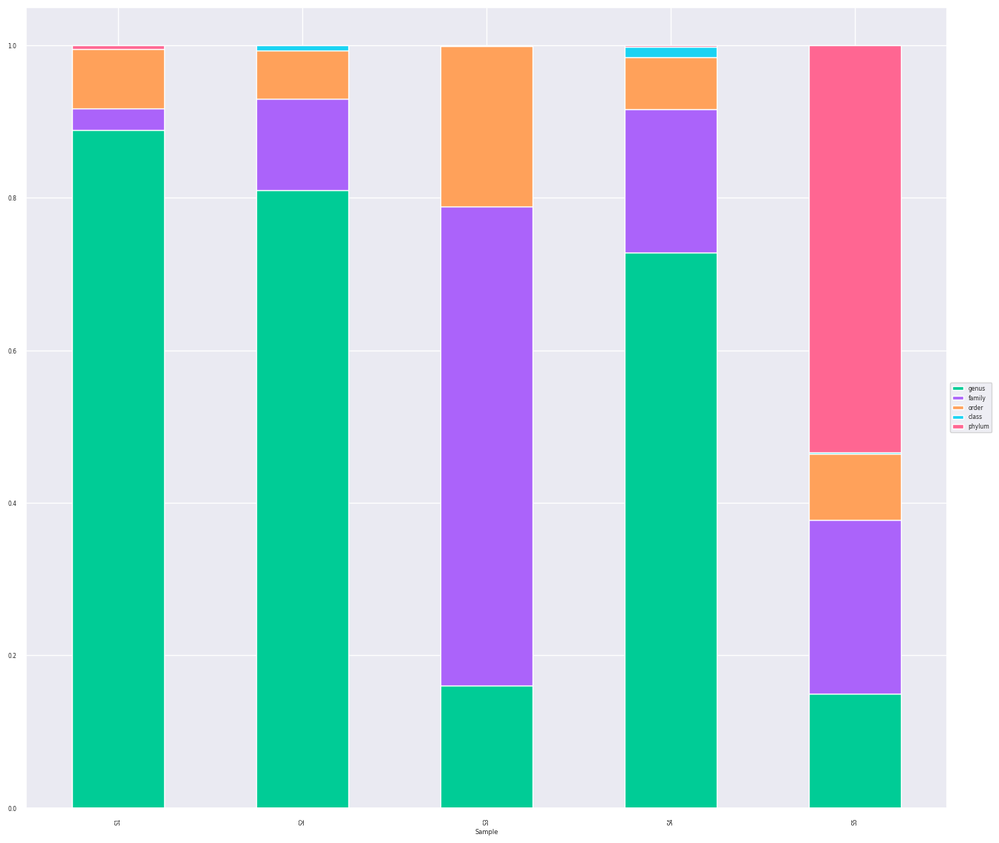

# Tabigecy tutorial

An explanation of several outputs of Tabigecy and how they can be used.
I also try to explain some issues that can be encountered when using Tabigecy.

## Input

For this tutorial, semi-artificial data are used:

- `tutorial_example_affiliations.tsv`: input taxonomic affiliations.
- `tutorial_example_abundance.csv`: abundance associated with the taxonomic affiliations for 5 samples.
- `esmecata_database.zip`: esmecata precomputed database can be downloaded from this [Zenodo archive](https://doi.org/10.5281/zenodo.13354073).

The outputs were generated using the command: `nextflow run ../tabigecy.nf --infile input/tutorial_example_affiliations.tsv --inAbundfile input/tutorial_example_abundance.csv --precomputedDB ../esmecata_database.zip --outputFolder output_folder --coreBigecyhmm 35`

## EsMeCaTa coverage of the samples

A first thing to explore Tabigecy's output is to look at how well the samples have been covered by EsMeCaTa.
Tabigecy produces several files that show which taxonomic ranks were used by EsMeCaTa to predict protein contents for the different taxa present in the samples.
The figure located at `output_folder/output_3_visualisation/function_abundance/barplot_esmecata_found_taxon_sample.png` illustrates this information:


On the abscissa, each bar corresponds to a sample. The value of the ordinate corresponds to the relative abundance of the organisms present in each sample. The color indicates which taxonomic rank has been used by EsMeCaTa to predict the protein content. Here, in red the genus level and in green the family level. In this exmaple, the four first samples were predicted mostly at the genus and family levels, except for sample 5. This sample 5 contains half of its community associated with grey color (indicating that EsMeCaTa was not able to make prediction for the associated organisms).

For the missing predictions, more information can be found in the file `output_folder/output_3_visualisation/function_abundance/barplot_esmecata_missing_organism_sample.tsv`:

| Sample |Organism_name| Taxonomic rank selected by EsMeCaTa |Relative abundance|
|------------------|---------------------|------------------|---------------------|
| S1        | Gracilibacteria       | Not found        | 0.0053475935828877       |
| S3        | Gracilibacteria       | Not found        |     0.0010162601626016261   |
| S4        | Gracilibacteria            | Not found        | 0.002026342451874367            |
| S5        | Gracilibacteria       | Not found        | 0.5338809034907598       |
			
This file shows each organisms that has not been found by EsMeCaTa. In our example, it consists of `Gracilibacteria`. This means that this taxon and its associated higher taxa are not found in the precomputed database.

When using the precomputed database with EsMeCaTa, there is an additional file (located at `output_folder/output_1_esmecata/organism_not_found_in_database.tsv`) showing which organisms were not found.

Missing organisms in the precomputed database can be the result of several points:

- (1) difference between the database that has been used for the taxonomic assignment and the one used by EsMeCaTa. EsMeCaTa relies on the NCBI Taxonomy database, other databases can used different taxon names. You can find the associated taxon names in the [NCBI Taxonomy database](https://www.ncbi.nlm.nih.gov/taxonomy). 
- (2) the taxon can be old or has been replaced by a synonym. EsMeCaTa (by using ete package) should be able to handle several synonyms but not all.
- (3) incorrect version between EsMeCaTa precomputed database and the NCBI taxonomic version. The version of EsMeCaTa precomputed database used in this tutorial (v1) has been generated with NCBI Taxonomy database version `2024-10-01`.
- (4) mismatches between taxon name from NCBI Taxonomy and from UniProt Proteomes databases.
- (5) there was not enough proteomes (by default EsMeCaTa requires at least 5 proteomes) available present in UniProt Proteomes database. To do this, you can search the [UniProt proteomes database](https://www.uniprot.org/proteomes). For example, `Gracilibacteria` is associated with only two proteomes (at the moment of writing this tutorial, it can changed, look [here](https://www.uniprot.org/proteomes?query=taxonomy_name%3DGracilibacteria+AND+%28busco%3A%5B80+TO+*%5D%29)).

Issue 1 is quite difficult to solve without performing a new taxonomic assignment.
Issues 2, 3, 4 can be solved by renaming the taxon so that it matches a taxon name form the database.
Issue 5 requires to run EsMeCaTa with less stringent parameters. A small EsMeCaTa precomputed database has been generated for poorly sequenced phyla (`esmecata_database_phyla`, currently not in a public repository, I am searching a place to drop it).

In our example, there was not enough proteomes for the `Gracilibacteria` taxon so it is not present in the precomputed database. Another precomputed database specific to poorly characterised has been generated and contains this taxon. Tabigecy can combined several precomputed databases with the following command:

`nextflow run ../tabigecy.nf --infile input/tutorial_example_affiliations.tsv --inAbundfile input/tutorial_example_abundance.csv --precomputedDB "../esmecata_database.zip ../esmecata_database_phyla.zip" --outputFolder output_folder_2 --coreBigecyhmm 35`

Tabigecy uses the second database `esmecata_database_phyla` to make predictions for `Gracilibacteria` and this can be seen in the `barplot_esmecata_found_taxon_sample.png` file:



Now, half the abundance of sample 5 is associated with phylum `Candidatus Parcubacteria`.

## Function prediction

The predicted functions for the community are present in folder `output_folder/output_2_bigecyhmm` and `output_folder/output_3_visualisation/function_occurrence`.

For main functions, their presence in the input organisms are listed in `output_folder/output_3_visualisation/function_occurrence/pathway_presence_in_organism.tsv`:

| function  |C-S-01:Organic carbon oxidation| C-S-02:Carbon fixation |...|
|------------------|---------------------|------------------|---------------------|
| Halomonas        | 1       | 0        | ...       |
| Dethiosulfatibacter        | 1       | 0        |     ...   |
| Methermicoccus        | 1            | 1        | ...            |
| ...        | ...       | ...        | ...       |

There is the same file for the more precise functions in `output_folder/output_3_visualisation/function_occurrence/function_occurrence_in_organism.tsv`.

You can traceback how the prediction was made through Tabigecy output files.

First, you need to map your organism name with the taxon ID used by EsMeCaTa. You cna find this mapping in the file `output_folder/output_1_esmecata/0_proteomes/proteome_tax_id.tsv`. The column `observation_name` corresponds to your organism name (`observation_name` of your input file) and EsMeCaTa taxon ID is in column `tax_id_name`:

| observation_name  |name| tax_id |tax_id_name|...|
|------------------|---------------------|------------------|---------------------|--------------------|
| Halomonas        | Halomonas       | 2745        |Halomonas__taxid__2745| ...       |
| ...        | ...       | ...        | ...|...       |

`Halomonas` is associated with `Halomonas__taxid__2745`.

You can find in file `output_folder/output_2_bigecyhmm/pathway_presence_hmms.tsv` the predicted HMMs associated with major functions for the taxon selected by EsMeCaTa. And you can have the HMM results in folder `output_folder/output_2_bigecyhmm/hmm_results` by seaching for the file associated with EsMeCaTa taxon (`Halomonas__taxid__2745.tsv` for Halomonas). In this file, you have a column indicating the reference HMM and the column `protein` showing the protein ID that is matching.

You cna find the protein sequences by searchin for the protein ID in the files present in `output_folder/output_1_esmecata/1_clustering/reference_proteins_consensus_fasta/`. For example, `Halomonas__taxid__2745.faa` contains all the consesnsus proteins predicted by EsMeCaTa for *Halomonas*.

In the folder `output_folder/output_1_esmecata/1_clustering/computed_threshold/`, you can see, for each taxon, how well conserved the protein is in the different proteomes that were used for the predictions. 

## Function abundance computation

The abundance associated with functions predicted by Tabigecy are presented in two ways:

**(1) absolute abundance**: this consists of summing the abundance of organisms predicted to have this function.

```math
F(f,s)=\sum_{i=0}^nA(i)
```

where:
- *F(f,s)* is the absolute abundance of the function f in sample *s*.
- *n* is the number of organisms predicted to have a function *f*.
- *A(i)* is the absolute abundance of organism *i* predicted to have function *f* in sample *s*.

The absolute abundance for each function and sample can be found in the file `output_folder/output_3_visualisation/function_abundance/cycle_abundance_sample_raw.tsv`.

**(2) relative abundance**: this consists of summing the abundance of organisms predicted to have this function and divided it by the total abundance of organisms in the sample.


```math
F(f,s)=\frac{\sum_{i=0}^nA(i)}{A(s)}
```

where:
- *F(f,s)* is the relative abundance of the function *f* in sample *s*. It goes from 0 (function absent in all organisms of the community) to 1 (function present in all organisms of the community).
- *n* is the number of organisms predicted to have function *f*.
- *A(i)* is the absolute abundance of organisms *i* predicted to have function *f*  (from your input file) in sample *s*.
- *A(s)* is the total abundance of organisms in sample *s*.

The relative abundance for each function and sample can be found in the file `output_folder/output_3_visualisation/function_abundance/cycle_abundance_sample.tsv`.

These different values can be seen in the diagram figures located at `output_folder/output_3_visualisation/function_abundance/cycle_diagrams_abundance/*_cycle_*.png`:


*Abundance* corresponds to the absolute abundance associated with organisms linked to the functions. *Percentage* corresponds to the relative abundance multiplied by 100.

The relative abundance is also shown in the polar plot `output_folder/output_3_visualisation/function_abundance/polar_plot_abundance_samples.png`:


Relative abundance goes from 0 to 1 and each function is set on the angular axis.

